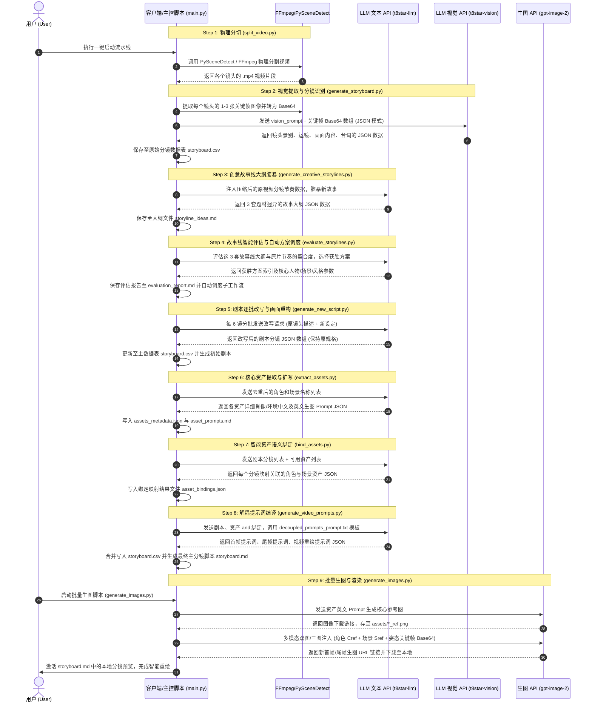

# videoMVP

## 🎬 智能视频重绘与分镜重塑工作流 (Sequence Flow)

以下为工作流从**物理镜头分割**、**多模态视觉识别**、**创意大纲脑暴与智能评估**，到**剧本改写**、**资产语义绑定**、**解耦提示词编译**以及最后的**多模态 Cref/Sref 生图**的完整 UML 时序流程：



---

## 📖 核心使用指南

### 第一步：一键运行流水线生成剧本
在项目根目录下打开终端，运行：
```bash
python main.py
```
* **效果**：脚本会自动化执行视频切割、帧提取、故事大纲脑暴与评估，并完成剧本的改写及提示词编译，在 `output/` 中输出 `storyboard.csv`、`storyboard.md` 等数据。
* **说明**：此步骤不调用生图接口，速度快且不产生高昂的图像 API 费用，以便您先校验剧本文案。

### 第二步：准备视觉资产参考图 (人脸锁 / Cref)
根据流水线在 `output/asset_prompts.md` 中为您规划的角色：
* **选择 A：上传自己准备的高一致性人脸**：
  您可以把您自定义好的参考图放入 `assets/` 目录中，并命名为对应名称（例如：`lin_he_ref.png`、`zhou_bo_ref.png`）。
* **选择 B：让大模型代为生成基础参考图**：
  如果不上传任何图，生图脚本会在下一步自动调用 API 帮您生出默认的角色参考图。

### 第三步：批量生成所有镜头的分镜图
在终端执行批量图生图下载脚本：
```bash
python scripts/generate_images.py
```
* **效果**：脚本将读取剧本，把所有的**人脸资产图**（多角色可同时输入）与原片提取的**构图姿态关键帧**全部在内存中优化压缩，并以多模态 payload 传入大模型生图，自动将图片保存至 `assets/`。
* **结果**：全部运行完成后，用支持预览的 Markdown 查看器（如 VS Code 预览）打开 `output/storyboard.md`，即可浏览已激活且对齐的高精度重绘分镜。
